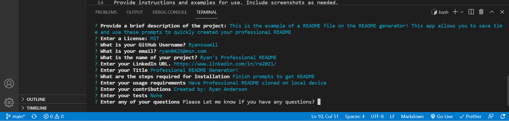

## Ryan's Professional README Generator

## Description

Have you ever wanted a quick and easy way to create your README files for your projects? I have created a generator to help with professional README's. Follow the prompts as guided and you will have a populated README doc!!

## Installation

What are the steps required to install your project? Provide a step-by-step description of how to get the development environment running.
-Clone to your device and run on your local device!

## Usage

Provide instructions and examples for use. Include screenshots as needed.
Navigate through the different prompts to help guide you to your README file.

## How to Contribute

If you created an application or package and would like other developers to contribute it, you can include guidelines for how to do so. The [Contributor Covenant](https://www.contributor-covenant.org/) is an industry standard, but you can always write your own if you'd prefer. Ryan Anderson

## Tests

Provide examples or screenshots to prove working.

## ScreenShot

## Credits

Ryan Anderson

What is your GitHub username? @Ryannswell

What is your email? ryan0425@msn.com

What is the name of your project? Professional README Generator

What is your LinkedIn? https://www.linkedin.com/in/ra2021/
